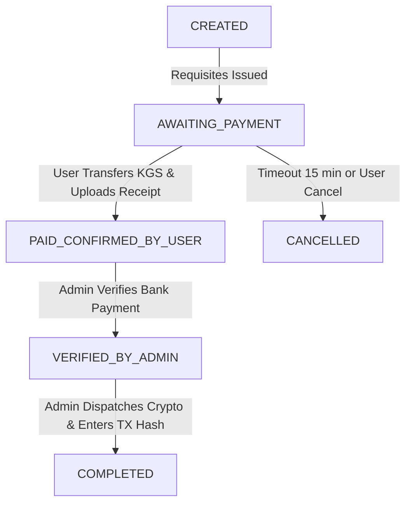

# 🇰🇬 USDT Kyrgyzstan (USDTKG) — B2C P2P Purchasing Platform

> Modern, high-converting, and SEO-optimized B2C Tether (USDT) purchasing platform tailored for Kyrgyzstan, supporting **KGS (Сом)** and **USD ($)** via local bank cards (**MBank, Optima Bank, DemirBank, Bakai Bank, Visa & Mastercard**) across 4 blockchain networks (**TRC-20, BEP-20, TON, ERC-20**).

---

## 🚀 Architecture & Tech Stack

```
                                  ┌────────────────────────┐
                                  │   Next.js 14 Frontend  │
                                  │  (App Router, Tailwind)│
                                  └───────────┬────────────┘
                                              │
                    ┌─────────────────────────┴─────────────────────────┐
                    ▼                                                   ▼
       ┌────────────────────────┐                          ┌────────────────────────┐
       │   FastAPI Python API   │                          │  Supabase PostgreSQL   │
       │ (Calculations & Escrow)│                          │(Realtime & Deal Chat)  │
       └────────────────────────┘                          └────────────────────────┘
```

- **Frontend**: Next.js 14 (App Router), TypeScript, Tailwind CSS, Lucide-react, Shadcn UI styling.
- **Backend**: Python 3.11+ (FastAPI), Pydantic v2 schemas, cryptographic wallet validators for 4 networks.
- **Database & Realtime**: Supabase (PostgreSQL with RLS, Realtime replication on orders and chat, Storage bucket for payment receipts).
- **Crypto Networks Supported**:
  - **TRC-20** (Tron) — Most popular exchange network.
  - **BEP-20** (BNB Smart Chain) — Low-fee fast transfers (~1 min).
  - **TON** (The Open Network) — Telegram Wallet & Tonkeeper instant transfers ($0.25 fee).
  - **ERC-20** (Ethereum) — High-security large transfer standard.
- **SEO & Localization**: Kyrgyzstan focused (Bishkek / Osh / Remote), JSON-LD `FinancialService` schema, dynamic XML sitemap, meta tags in Russian and Kyrgyz.

---

## 📁 Repository Structure

```
├── frontend/                     # Next.js 14 App Router + Tailwind + TypeScript
│   ├── app/
│   │   ├── layout.tsx            # SEO Metadata, JSON-LD Schema & Layout
│   │   ├── page.tsx              # SEO Landing Page & Hero
│   │   ├── order/[id]/page.tsx   # Live Order Tracking & Deal Chat
│   │   ├── admin/page.tsx        # Admin Dashboard Page
│   │   ├── sitemap.ts            # Dynamic XML Sitemap
│   │   └── robots.ts             # Robots.txt
│   ├── components/
│   │   ├── Navbar.tsx            # Live rate ticker & Bishkek local clock
│   │   ├── ExchangeCalculator.tsx# Dynamic currency converter
│   │   ├── NetworkSelector.tsx   # TRC-20, BEP-20, ERC-20, TON selector
│   │   ├── OrderFormModal.tsx    # Wallet validation & bank selection
│   │   ├── OrderTracker.tsx      # Countdown timer, copyable card & receipt uploader
│   │   ├── OrderChat.tsx         # Supabase Realtime deal chat
│   │   ├── TrustBadges.tsx       # Reviews & Live USDT reserves
│   │   ├── FaqSection.tsx        # SEO FAQ for Kyrgyzstan
│   │   └── AdminDashboard.tsx    # Order review, USDT dispatch & rate editor
│   └── lib/
│       ├── supabase.ts           # Supabase client & storage helpers
│       ├── validation.ts         # Multi-network crypto address validator
│       └── api.ts                # Backend API connector
│
├── backend/                      # Python FastAPI Service
│   ├── app/
│   │   ├── main.py               # App entrypoint & CORS
│   │   ├── config.py             # Environment settings & secrets
│   │   ├── schemas/              # Pydantic v2 models (Orders, Rates, Chat, Admin)
│   │   ├── services/             # RateEngine, WalletValidator, SupabaseService
│   │   └── routers/              # Rates, Orders, Chat, Admin endpoints
│   ├── requirements.txt
│   └── Dockerfile
│
├── supabase/                     # SQL Migrations & Seed Data
│   ├── migrations/
│   │   ├── 001_initial_schema.sql         # Tables & Realtime publications
│   │   ├── 002_triggers_and_functions.sql # Automatic status notifications & codes
│   │   └── 003_storage_and_rls.sql        # Storage bucket & RLS policies
│   └── seed.sql                           # Initial rates, banks & reserves
│
├── docker-compose.yml            # Multi-container orchestration
├── vercel.json                   # Fullstack Next.js deployment
└── README.md
```

---

## ⚡ Quick Start & Setup

### 1. Database Setup (Supabase)

1. Create a project at [supabase.com](https://supabase.com).
2. Go to **SQL Editor** in your Supabase dashboard and execute the migration files in order:
   - Run `supabase/migrations/001_initial_schema.sql`
   - Run `supabase/migrations/002_triggers_and_functions.sql`
   - Run `supabase/migrations/003_storage_and_rls.sql`
   - Run `supabase/seed.sql`
3. Retrieve your **Project URL**, **Anon Key**, and **Service Role Key** from **Project Settings $\rightarrow$ API**.

---

### 2. Backend Setup (FastAPI)

```bash
cd backend

# Create virtual environment
python -m venv venv
# Windows:
.\venv\Scripts\activate
# Linux/macOS:
source venv/bin/activate

# Install dependencies
pip install -r requirements.txt

# Create .env file (copy from .env.example)
cp .env.example .env

# Run FastAPI server
uvicorn app.main:app --reload --port 8000
```
- Interactive API Docs (Swagger UI): `http://localhost:8000/docs`

---

### 3. Frontend Setup (Next.js 14)

```bash
cd frontend

# Install packages
npm install

# Setup environment variables
cp .env.example .env.local

# Run Next.js development server
npm run dev
```
- Open `http://localhost:3000` in your browser.

---

## 🛡 Order Lifecycle & Escrow Flow



1. **`CREATED` / `AWAITING_PAYMENT`**:
   - Order code assigned (e.g. `KG-82914`).
   - 15-minute countdown clock starts.
   - Bank requisites displayed with one-click copy (MBank / Optima / Demir / Bakai card number & recipient).
2. **`PAID_CONFIRMED_BY_USER`**:
   - Buyer uploads receipt screenshot (stored in Supabase Storage `order-receipts`).
   - Automated system notification triggers in the Live Chat.
3. **`VERIFIED_BY_ADMIN`**:
   - Operator checks bank statement or mobile bank notification.
4. **`USDT_DISPATCHED` / `COMPLETED`**:
   - USDT dispatched to buyer's wallet.
   - On-chain transaction hash (TX Hash) is recorded with clickable block explorer links (Tronscan, BscScan, Tonscan, Etherscan).

---

## 🔑 Operator / Admin Dashboard

- **URL**: `http://localhost:3000/admin`
- **Default Secret Key**: `kg_admin_secret_key_bishkek_2026`
- **Features**:
  - Real-time incoming order notifications with sound chime.
  - Review uploaded payment receipts at full resolution.
  - Verify payments with 1-click and dispatch USDT orders with TX hash.
  - Live margin and base USD/KGS rate configurator.
  - Manage bank card requisites (MBank, Optima, Demir, Bakai).

---

## 🐳 Docker Deployment

Run the complete platform locally or on a VPS with a single command:

```bash
docker-compose up --build -d
```

Frontend will be accessible at `http://localhost:3000` and API at `http://localhost:8000`.

---

## 🔍 SEO Strategy for Kyrgyzstan

- **High-intent Keywords**:
  - `Купить USDT в Кыргызстане`
  - `USDT Бишкек Visa Mastercard`
  - `Tether KGS обмен`
  - `Кыргызстан USDT сатып алуу` (Kyrgyz)
  - `MBank купить USDT`
  - `Оптима банк крипта Кыргызстан`
- **Structured Data**: Google Rich Results `FinancialService` and `ExchangeRateSpecification` JSON-LD schema.
- **Dynamic SEO**: Auto-generated XML Sitemap (`/sitemap.xml`) and search engine directives (`/robots.txt`).
